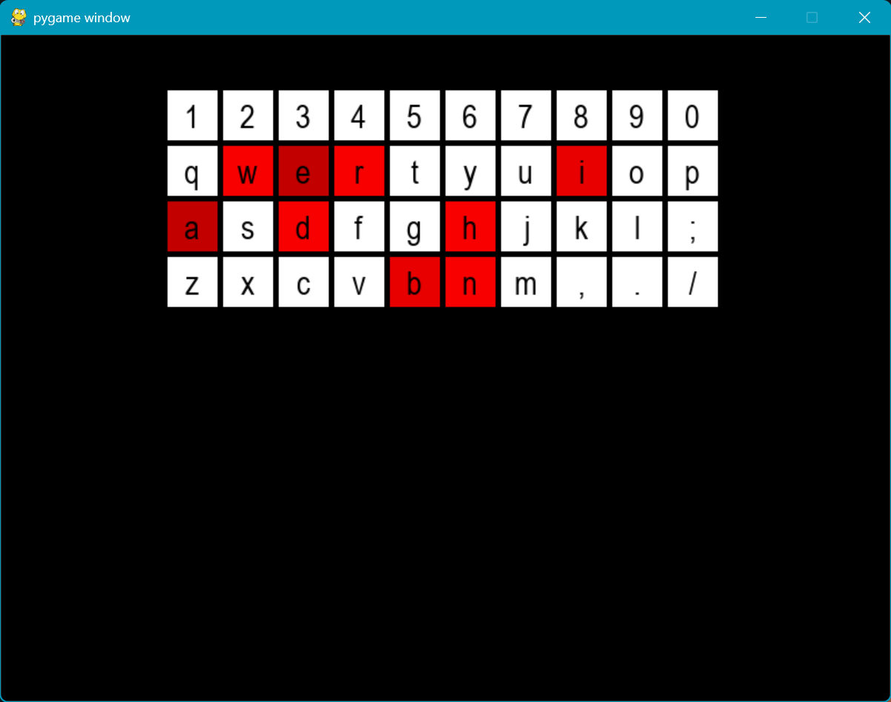

# KeySense

**KeySense** is a real-time keyboard heatmap tracker and logger built in Python. It captures global keypress events, visualizes usage intensity in a Pygame-based UI, and logs the frequency and timestamp of each keypress. This project is useful for productivity tracking, typing behavior analysis, or just for fun!

 <!-- (Optional if you add an image) -->

---

## 🔍 Features

- ✅ Real-time global keypress tracking using `keyboard`
- ✅ Heatmap visualization of key usage in a grid layout
- ✅ Key press logging with timestamps to `keylog.txt`
- ✅ Persistent frequency stats saved in `keystats.json`
- ✅ Live updates without interrupting other programs
- ✅ Visual intensity scaling based on keypress frequency
- ✅ Easy-to-understand interface using `pygame`

---

## 🚀 Getting Started

### 1. Clone the repository